```mermaid
graph LR
    A[🌐 Web App] -->|MongoDB Protocol| D[(🗃️ DocumentDB)]
    B[🚀 API Service] -->|MongoDB Protocol| D
    C[⚙️ Worker Service] -->|MongoDB Protocol| D
```

We're building something amazing! The technical architecture documentation is coming soon.

Pull the latest DocumentDB Docker container image:

```bash
docker pull ghcr.io/documentdb/documentdb/documentdb-local:latest
```

Here's a Mermaid diagram of a sample application you can build with DocumentDB:



Here's a screenshot of DocumentDB's [Visual Studio Code extension](https://marketplace.visualstudio.com/items?itemName=ms-azuretools.vscode-documentdb):


