We're building something amazing! The technical architecture documentation is coming soon.

Here's some example code:

```bash
npx run-something-amazing-with-documentdb
```

And a Mermaid diagram:

```mermaid
graph LR
    A[🌐 Web App] -->|MongoDB Protocol| D[(🗃️ DocumentDB)]
    B[🚀 API Service] -->|MongoDB Protocol| D
    C[⚙️ Worker Service] -->|MongoDB Protocol| D
```


